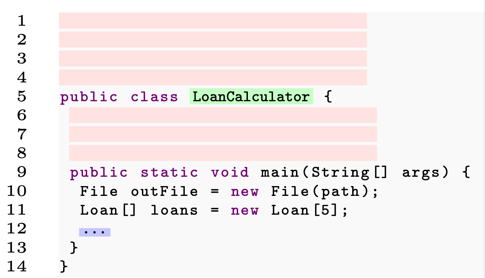
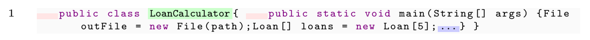

# GPTSniffer

Since its launch in November 2022, ChatGPT has amassed attention from many users. In particular, programmers have started to leverage it to get help for several development problems. For example, ChatGPT can provide users with code snippets that fulfill a given development task. However, while offering a practical solution to programming problems, ChatGPT should be mainly used only as a supporting tool rather than as a replacement for the human being. This is particularly crucial in software education, where students are not expected to rely entirely on ChatGPT or similar systems to conduct their assign- ments. This triggers the need to detect source code written by ChatGPT automatically. While tools to identify content generated by AI exist, they may need to work properly on source code. In this paper, we conceptualize GPTSniffer as a novel approach to the detection of source code written by ChatGPT. GPTSniffer is built on top of CodeBERT, a model pre-trained with large corpora of source code. We collected a dataset consisting of code written by humans and then queried ChatGPT to get snippets generated by the platform. Finally, we present an empirical evaluation on the collected datasets, and compare GPTSniffer with two existing baselines. The experimental results show that GPTSniffer can give precise classification for several testing instances. More importantly, it outperforms both baselines with respect to the prediction accuracy.

## Introduction

ChatGPT is a generative Artificial Intelligence (AI) tool, being able to produce convincingly human answers to queries from users. Since its public release on November 30, 2022, the system has become a phenomenon as it has garnered attention from both expert- and non expert users worldwide, reaching one million users only five days after the launching. ChatGPT rises to fame thanks to its ability to provide human- like answers, as well as to maintain a thread of conversation in a natural way.

One of the areas in which ChatGPT appears to be partic- ularly promising and fascinating is in its ability to support developers in a variety of tasks, that range from writing source code that fulfills a given (natural language) specification, creating a software architecture/design, generating tests, or fixing a bug.

Leveraging ChatGPT to get recommendations for source code solutions is becoming very popular among developers. This does not happen without risks, as it has been shown that ChatGPT could provide vulnerable code, and also there is a wide discussion about possible copyright and licensing infringements related to reusing its recommended code.
1GPT stands for Generative Pre-trained Transformer. 

When ChatGPT or generic code recommenders are used by students during their learning processes, issues on risks and benefits arise, and this has triggered quite some discussion among educators. On the positive side, code snippets generated by ChatGPT provide students with a practical way to complete their assignment. Also, several educators believe that one of the skills of developers working with the state-of-the-practice technology is their ability to retrieve, review and integrate pieces of software. At the same time, one major risk is that students would not develop some essential skills that can be acquired only through self-learning, e.g., critical thinking and problem-solving. Moreover, handing in code written by ChatGPT as a whole, i.e., without any concrete self-work, can be considered as a form of fraud. Such kind of behaviors triggers concerns over ethics, as students have their work done without actually performing their own research.

Lately, as a precautionary measure, some universities in different countries even imposed a ban on ChatGPT, prohibiting their students from using the system to generate solutions for homework, or to compose essays. In the Software Engineering community, one the one hand, we advocate for the democratized use of AI tools to ease daily programming tasks, thus improving the working performance. On the other hand, we believe that it is necessary to recognize when a source code element has been written by the AI for various reasons, and, essentially _(i)_ from the professional development side, dealing with security and legal problems; and _(ii)_ from the educational side, coping with cheating and plagiarism.

Recently, GPTZero has been developed as one of the first systems to automatically help users recognize if a text is written by OpenAI technologies.Interestingly, by several attempts playing with the platform, we realized it is not good at distinguishing between source code written by humans and machines. We suppose that the underpinning engine has been trained on natural language text, rather than source code. Altogether, this necessitates proper tools to identify the real author of a code snippet.
This paper proposes GPTSniffer–a machine learning solu- tion to determine whether a piece of source code has been generated by ChatGPT. The classification engine is based on CodeBERT, a pre-trained model built on top of a code search dataset, i.e., CodeSearchNet. While it has been widely used by Software Engineering research to provide code recommendation, CodeBERT has never been applied to the detection of source code. 

## Configuration pictures
We used 8 experimental configurations, which are indeed not exhaustive, as we cannot consider all possible combinations of artifacts. Thus, we pay attention only to those most representative and realistic. Due to space limits, the paper did not display a figure to illustrate the code examples for C7 C8. We report the missing consiguration in the follows:

 * Example C7

 * Example C8
 

